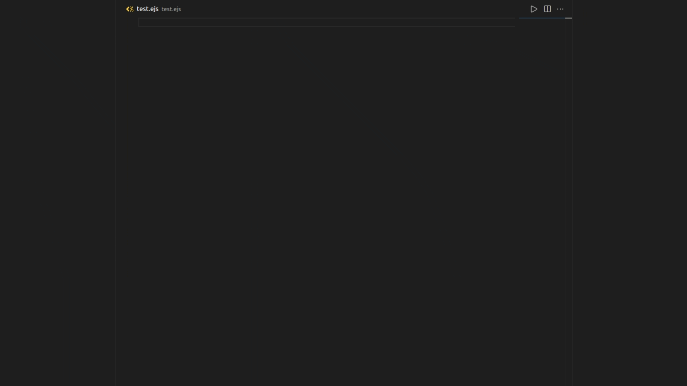

# EJS Snippets And Color Highlighting

### NOTICE: If you are not seeing any style, set your file associations for "\*.ejs" to html

Add snippets for Ejs and some colors for better visualization

Please rate this and provide feedback It helps me know what I need to improve.

If there is anything that I missed or features you would like this to include. [Let me know](https://github.com/Ayush-Chugh-2006/ejs-language-snippets-and-color-highlighting-vscode/issues)

## Features

**_If snippets do not show up, add the following to your settings file_**

```json
    "emmet.includeLanguages": {
        "ejs": "html",
    },
```

**Snippets are found below.**

| Snippet     | Output                                       |
| ----------- | -------------------------------------------- |
| `ejs`       | `<% %>` - No output tag                      |
| `ejsout`    | `<%= %>` - Outputs HTML value                |
| `ejsesc`    | `<%- %>` - Outputs unescaped                 |
| `ejscom`    | `<%# %>` - Comment tag                       |
| `ejslit`    | `<%% %>` - Outputs Literal <%                |
| `ejsinc`    | `include` statement                          |
| `ejsfor`    | `for` Javascript Loop                        |
| `ejseach`   | `forEach` Javascript Loop                    |
| `ejsforof`  | `forOf` Javascript Loop                      |
| `ejsforin`  | `forIn` Javascript Loop                      |
| `ejsif`     | `if` Statement with condition                |
| `ejsifelse` | `if else` Statement with condition           |
| `ejster`    | `tertiary operator` Statement with condition |

#



## EJS docs

If you need documention on how to use EJS:

[EJS Github](https://github.com/mde/ejs)
[EJS Website](https://ejs.co/)
